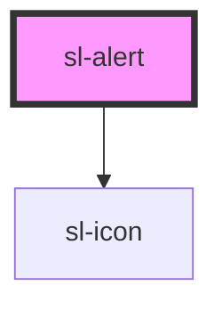

# Alert

```html preview
<sl-alert type="primary">
  <strong>Your changes have been saved</strong><br>
  You can continue working or safely leave the app now.
</sl-alert><br>
<sl-alert type="success">
  <strong>Your changes have been saved</strong><br>
  You can continue working or safely leave the app now.
</sl-alert><br>
<sl-alert type="info">
  <strong>Your changes have been saved</strong><br>
  You can continue working or safely leave the app now.
</sl-alert><br>
<sl-alert type="warning">
  <strong>Your changes have been saved</strong><br>
  You can continue working or safely leave the app now.
</sl-alert><br>
<sl-alert type="danger">
  <strong>Your changes have been saved</strong><br>
  You can continue working or safely leave the app now.
</sl-alert>
```

```html preview
<sl-alert type="primary">
  <sl-icon slot="icon" name="info-circle"></sl-icon>
  <strong>Your changes have been saved</strong><br>
  You can continue working or safely leave the app now.
</sl-alert><br>

<sl-alert type="success">
  <sl-icon slot="icon" name="check-circle"></sl-icon>
  <strong>Your changes have been saved</strong><br>
  You can continue working or safely leave the app now.
</sl-alert><br>

<sl-alert type="info">
  <sl-icon slot="icon" name="gear"></sl-icon>
  <strong>Your changes have been saved</strong><br>
  You can continue working or safely leave the app now.
</sl-alert><br>

<sl-alert type="warning">
  <sl-icon slot="icon" name="exclamation-triangle"></sl-icon>
  <strong>Your changes have been saved</strong><br>
  You can continue working or safely leave the app now.
</sl-alert><br>

<sl-alert type="danger">
  <sl-icon slot="icon" name="exclamation-octagon"></sl-icon>
  <strong>Your changes have been saved</strong><br>
  You can continue working or safely leave the app now.
</sl-alert>
```

```html preview
<sl-alert type="primary" closable>
  <strong>Your changes have been saved</strong><br>
  You can continue working or safely leave the app now.
</sl-alert><br>

<sl-alert type="success" closable>
  <strong>Your changes have been saved</strong><br>
  You can continue working or safely leave the app now.
</sl-alert><br>

<sl-alert type="info" closable>
  <strong>Your changes have been saved</strong><br>
  You can continue working or safely leave the app now.
</sl-alert><br>

<sl-alert type="warning" closable>
  <strong>Your changes have been saved</strong><br>
  You can continue working or safely leave the app now.
</sl-alert><br>

<sl-alert type="danger" closable>
  <strong>Your changes have been saved</strong><br>
  You can continue working or safely leave the app now.
</sl-alert>
```

<!-- Auto Generated Below -->


## Properties

| Property   | Attribute  | Description                             | Type      | Default     |
| ---------- | ---------- | --------------------------------------- | --------- | ----------- |
| `closable` | `closable` | Set to true to make the alert closable. | `boolean` | `false`     |
| `closed`   | `closed`   | Set to true to close the alert.         | `boolean` | `false`     |
| `type`     | `type`     | The type of alert to draw.              | `string`  | `'primary'` |


## Events

| Event     | Description                       | Type               |
| --------- | --------------------------------- | ------------------ |
| `slClose` | Emitted when the alert is closed. | `CustomEvent<any>` |


## Slots

| Slot           | Description                                      |
| -------------- | ------------------------------------------------ |
|                | The alert's content.                             |
| `"close-icon"` | An icon to use in lieu of the normal close icon. |
| `"icon"`       | An icon to show in the alert.                    |


## Dependencies

### Depends on

- [sl-icon](../icon)

### Graph


----------------------------------------------


