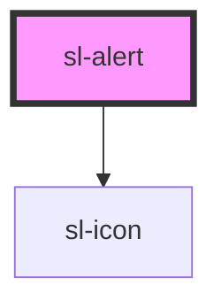

# Alert

```html preview
<sl-alert type="primary" open>
  Nothing fancy here, just a simple alert.
</sl-alert><br>

<sl-alert type="primary" open closable>
  <sl-icon slot="icon" name="info"></sl-icon>
  This one is a bit fancier because now it has an icon and is closable.
</sl-alert>
```

## Types

```html preview
<sl-alert type="primary" open closable>
  <sl-icon slot="icon" name="info"></sl-icon>
  <strong>Your changes have been saved</strong><br>
  You can continue working or safely leave the app now.
</sl-alert><br>

<sl-alert type="success" open closable>
  <sl-icon slot="icon" name="check-circle"></sl-icon>
  <strong>Your changes have been saved</strong><br>
  You can continue working or safely leave the app now.
</sl-alert><br>

<sl-alert type="info" open closable>
  <sl-icon slot="icon" name="settings"></sl-icon>
  <strong>Your changes have been saved</strong><br>
  You can continue working or safely leave the app now.
</sl-alert><br>

<sl-alert type="warning" open closable>
  <sl-icon slot="icon" name="alert-triangle"></sl-icon>
  <strong>Your changes have been saved</strong><br>
  You can continue working or safely leave the app now.
</sl-alert><br>

<sl-alert type="danger" open closable>
  <sl-icon slot="icon" name="alert-octagon"></sl-icon>
  <strong>Your changes have been saved</strong><br>
  You can continue working or safely leave the app now.
</sl-alert>
```

<!-- Auto Generated Below -->


## Properties

| Property   | Attribute  | Description                                 | Type                                                        | Default     |
| ---------- | ---------- | ------------------------------------------- | ----------------------------------------------------------- | ----------- |
| `closable` | `closable` | Set to true to make the alert closable.     | `boolean`                                                   | `false`     |
| `open`     | `open`     | Indicates whether or not the alert is open. | `boolean`                                                   | `false`     |
| `type`     | `type`     | The type of alert.                          | `"danger" \| "info" \| "primary" \| "success" \| "warning"` | `'primary'` |


## Events

| Event         | Description                                                                                        | Type               |
| ------------- | -------------------------------------------------------------------------------------------------- | ------------------ |
| `slAfterHide` | Emitted after the alert closes and all transitions are complete.                                   | `CustomEvent<any>` |
| `slAfterShow` | Emitted after the alert opens and all transitions are complete.                                    | `CustomEvent<any>` |
| `slHide`      | Emitted when the alert closes. Calling `event.preventDefault()` will prevent it from being closed. | `CustomEvent<any>` |
| `slShow`      | Emitted when the alert opens. Calling `event.preventDefault()` will prevent it from being opened.  | `CustomEvent<any>` |


## Methods

### `hide() => Promise<boolean>`

Hides the alert

#### Returns

Type: `Promise<boolean>`


### `show() => Promise<boolean>`

Shows the alert.

#### Returns

Type: `Promise<boolean>`


## Slots

| Slot           | Description                                       |
| -------------- | ------------------------------------------------- |
|                | The alert's content.                              |
| `"close-icon"` | An icon to use in lieu of the default close icon. |
| `"icon"`       | An icon to show in the alert.                     |


## Dependencies

### Depends on

- [sl-icon](../icon)

### Graph


----------------------------------------------


