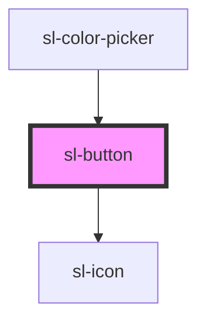

# sl-button

<!-- Auto Generated Below -->

## Properties

| Property   | Attribute  | Description                                                                        | Type                                                                               | Default     |
| ---------- | ---------- | ---------------------------------------------------------------------------------- | ---------------------------------------------------------------------------------- | ----------- |
| `caret`    | `caret`    | Set to true to draw the button with a caret for use with dropdowns, popovers, etc. | `boolean`                                                                          | `false`     |
| `circle`   | `circle`   | Set to true to draw a circle button.                                               | `boolean`                                                                          | `false`     |
| `disabled` | `disabled` | Set to true to disable the button.                                                 | `boolean`                                                                          | `false`     |
| `loading`  | `loading`  | Set to true to draw the button in a loading state.                                 | `boolean`                                                                          | `false`     |
| `pill`     | `pill`     | Set to true to draw a pill-style button with rounded edges.                        | `boolean`                                                                          | `false`     |
| `size`     | `size`     | The button's size.                                                                 | `"large" \| "medium" \| "small"`                                                   | `'medium'`  |
| `type`     | `type`     | The button's type.                                                                 | `"danger" \| "default" \| "info" \| "primary" \| "success" \| "text" \| "warning"` | `'default'` |

## Events

| Event     | Description                          | Type               |
| --------- | ------------------------------------ | ------------------ |
| `slBlur`  | Emitted when the button loses focus. | `CustomEvent<any>` |
| `slFocus` | Emitted when the button gains focus. | `CustomEvent<any>` |

## Methods

### `removeFocus() => Promise<void>`

Removes focus from the button.

#### Returns

Type: `Promise<void>`

### `setFocus() => Promise<void>`

Sets focus on the button.

#### Returns

Type: `Promise<void>`

## Slots

| Slot       | Description                                               |
| ---------- | --------------------------------------------------------- |
|            | The button's label.                                       |
| `"prefix"` | Used to prepend an icon or similar element to the button. |
| `"suffix"` | Used to append an icon or similar element to the button.  |

## Dependencies

### Used by

 - [sl-color-picker](../color-picker)

### Depends on

- [sl-icon](../icon)

### Graph

----------------------------------------------

*Built with [StencilJS](https://stenciljs.com/)*
