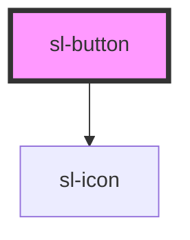

# Button

Good ol' buttons. They're usually the first thing I look at when reviewing a component library. Shoelace offers a variation for every theme color.

```html preview
<sl-button type="default">Default</sl-button>
<sl-button type="primary">Primary</sl-button>
<sl-button type="success">Success</sl-button>
<sl-button type="info">Info</sl-button>
<sl-button type="warning">Warning</sl-button>
<sl-button type="danger">Danger</sl-button>
```

## Pill

Use the `pill` prop to give buttons rounded edges.

```html preview
<sl-button type="default" pill>Default</sl-button>
<sl-button type="primary" pill>Primary</sl-button>
<sl-button type="success" pill>Success</sl-button>
<sl-button type="info" pill>Info</sl-button>
<sl-button type="warning" pill>Warning</sl-button>
<sl-button type="danger" pill>Danger</sl-button>
```

## Sizes

Use the `size` prop to change a button's size.

```html preview
<sl-button size="small">Small</sl-button>
<sl-button size="medium">Medium</sl-button>
<sl-button size="large">Large</sl-button>
```

## Circle

Use the `circle` prop to create circular icon buttons.

```html preview
<sl-button type="default" size="small" circle><sl-icon name="settings"></sl-icon></sl-button>
<sl-button type="default" size="medium" circle><sl-icon name="settings"></sl-icon></sl-button>
<sl-button type="default" size="large" circle><sl-icon name="settings"></sl-icon></sl-button>
```

## Text

Use `type="text"` to create text buttons, which share the same size as regular buttons but don't have backgrounds or borders.

```html preview
<sl-button type="text" size="small">Text</sl-button>
<sl-button type="text" size="medium">Text</sl-button>
<sl-button type="text" size="large">Text</sl-button>
```

## Block

Block buttons can be created by setting the button's width to `100%`.

```html preview
<sl-button type="default" size="small" style="width: 100%; margin-bottom: 1rem;">Small</sl-button>
<sl-button type="default" size="medium" style="width: 100%; margin-bottom: 1rem;">Medium</sl-button>
<sl-button type="default" size="large" style="width: 100%; margin-bottom: 1rem;">Large</sl-button>
```

## Icons

Use the `prefix` and `suffix` slots to add icons.

```html preview
<sl-button type="default">
  <sl-icon slot="prefix" name="settings"></sl-icon>
  Settings
</sl-button>
<sl-button type="default">
  <sl-icon slot="suffix" name="refresh-ccw"></sl-icon>
  Refresh
</sl-button>
<sl-button type="default">
  <sl-icon slot="prefix" name="link"></sl-icon>
  <sl-icon slot="suffix" name="external-link"></sl-icon>
  Open
</sl-button>
```

## Caret

Use the `caret` prop to add a dropdown indicator when a button will trigger a dropdown, menu, or popover.

```html preview
<sl-button size="small" caret>Small</sl-button>
<sl-button size="medium" caret>Medium</sl-button>
<sl-button size="large" caret>Large</sl-button>
```

## Loading

Use the `loading` prop to make a button busy. The width will remain the same as before, preventing adjacent elements from moving around.

```html preview
<sl-button type="default" loading>Default</sl-button>
<sl-button type="primary" loading>Primary</sl-button>
<sl-button type="success" loading>Success</sl-button>
<sl-button type="info" loading>Info</sl-button>
<sl-button type="warning" loading>Warning</sl-button>
<sl-button type="danger" loading>Danger</sl-button>
```

## Disabled

Use the `disabled` prop to disable a button.

```html preview
<sl-button type="default" disabled>Default</sl-button>
<sl-button type="primary" disabled>Primary</sl-button>
<sl-button type="success" disabled>Success</sl-button>
<sl-button type="info" disabled>Info</sl-button>
<sl-button type="warning" disabled>Warning</sl-button>
<sl-button type="danger" disabled>Danger</sl-button>
```


<!-- Auto Generated Below -->


## Properties

| Property         | Attribute         | Description                                                                        | Type                                                                               | Default     |
| ---------------- | ----------------- | ---------------------------------------------------------------------------------- | ---------------------------------------------------------------------------------- | ----------- |
| `caret`          | `caret`           | Set to true to draw the button with a caret for use with dropdowns, popovers, etc. | `boolean`                                                                          | `false`     |
| `circle`         | `circle`          | Set to true to draw a circle button.                                               | `boolean`                                                                          | `false`     |
| `disabled`       | `disabled`        | Set to true to disable the button.                                                 | `boolean`                                                                          | `false`     |
| `loading`        | `loading`         | Set to true to draw the button in a loading state.                                 | `boolean`                                                                          | `false`     |
| `nativeTabindex` | `native-tabindex` | The button's tabindex attribute.                                                   | `number`                                                                           | `undefined` |
| `pill`           | `pill`            | Set to true to draw a pill-style button with rounded edges.                        | `boolean`                                                                          | `false`     |
| `size`           | `size`            | The button's size.                                                                 | `"large" \| "medium" \| "small"`                                                   | `'medium'`  |
| `type`           | `type`            | The button's type.                                                                 | `"danger" \| "default" \| "info" \| "primary" \| "success" \| "text" \| "warning"` | `'default'` |


## Methods

### `removeFocus() => Promise<void>`

Removes focus from the button.

#### Returns

Type: `Promise<void>`


### `setFocus() => Promise<void>`

Sets focus on the button.

#### Returns

Type: `Promise<void>`


## Slots

| Slot       | Description                                               |
| ---------- | --------------------------------------------------------- |
|            | The button's label.                                       |
| `"prefix"` | Used to prepend an icon or similar element to the button. |
| `"suffix"` | Used to append an icon or similar element to the button.  |


## Dependencies

### Depends on

- [sl-icon](../icon)

### Graph


----------------------------------------------


