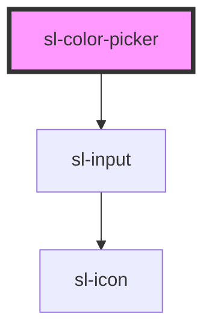

# Color Picker

```html preview
<sl-color-picker opacity></sl-color-picker>
```


<!-- Auto Generated Below -->


## Properties

| Property   | Attribute | Description                                       | Type       | Default                                                                                                                                                                                                                                 |
| ---------- | --------- | ------------------------------------------------- | ---------- | --------------------------------------------------------------------------------------------------------------------------------------------------------------------------------------------------------------------------------------- |
| `opacity`  | `opacity` | Whether to show the opacity slider.               | `boolean`  | `false`                                                                                                                                                                                                                                 |
| `swatches` | --        | An array of predefined color swatches to display. | `string[]` | `[     '#d0021b',     '#f5a623',     '#f8e71c',     '#8b572a',     '#7ed321',     '#417505',     '#bd10e0',     '#9013fe',     '#4a90e2',     '#50e3c2',     '#b8e986',     '#000',     '#444',     '#888',     '#ccc',     '#fff'   ]` |
| `value`    | `value`   | The current color.                                | `string`   | `''`                                                                                                                                                                                                                                    |


## Dependencies

### Depends on

- [sl-input](../input)

### Graph


----------------------------------------------


