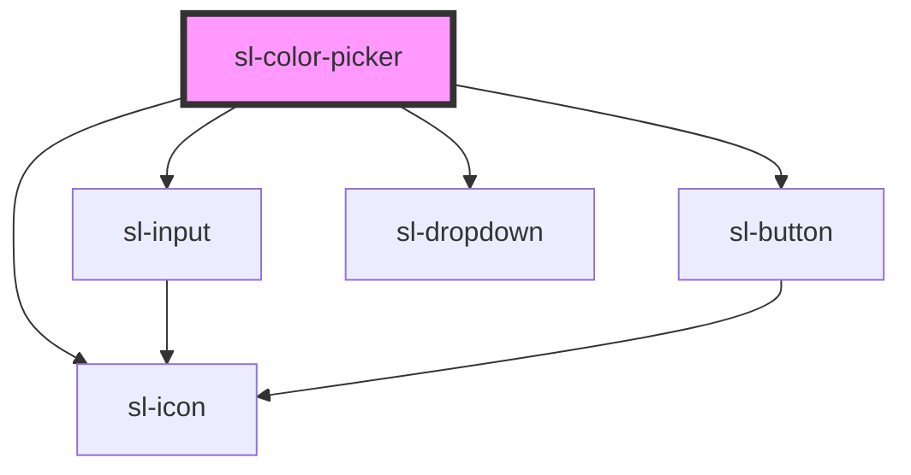

# Color Picker

```html preview
<sl-color-picker opacity></sl-color-picker>
```

```html preview
<sl-color-picker opacity inline></sl-color-picker>
```

<!-- Auto Generated Below -->


## Properties

| Property    | Attribute   | Description                                                                                                                                                                                                                                                              | Type                             | Default                                                                                                                                                                                                                                 |
| ----------- | ----------- | ------------------------------------------------------------------------------------------------------------------------------------------------------------------------------------------------------------------------------------------------------------------------ | -------------------------------- | --------------------------------------------------------------------------------------------------------------------------------------------------------------------------------------------------------------------------------------- |
| `disabled`  | `disabled`  | Set to true to disable the color picker.                                                                                                                                                                                                                                 | `boolean`                        | `false`                                                                                                                                                                                                                                 |
| `format`    | `format`    | The format to use for the generated color `value`. If opacity is enabled, these will translate to HEXA, RGBA, and HSLA respectively. Note that browser support for HEXA doesn't include pre-Chromium Edge, so it's usually safer to use RGBA or HSLA when using opacity. | `"hex" \| "hsl" \| "rgb"`        | `'hex'`                                                                                                                                                                                                                                 |
| `inline`    | `inline`    | Set to true to render the color picker inline rather than inside a dropdown.                                                                                                                                                                                             | `boolean`                        | `false`                                                                                                                                                                                                                                 |
| `opacity`   | `opacity`   | Whether to show the opacity slider.                                                                                                                                                                                                                                      | `boolean`                        | `false`                                                                                                                                                                                                                                 |
| `size`      | `size`      | When `inline` is true, this determines the size of the color picker's trigger.                                                                                                                                                                                           | `"large" \| "medium" \| "small"` | `'medium'`                                                                                                                                                                                                                              |
| `swatches`  | --          | An array of predefined color swatches to display. Can include any format the color picker can parse, including HEX(A), RGB(A), HSL(A), and CSS color names.                                                                                                              | `string[]`                       | `[     '#d0021b',     '#f5a623',     '#f8e71c',     '#8b572a',     '#7ed321',     '#417505',     '#bd10e0',     '#9013fe',     '#4a90e2',     '#50e3c2',     '#b8e986',     '#000',     '#444',     '#888',     '#ccc',     '#fff'   ]` |
| `uppercase` | `uppercase` | By default, the value will be set in lowercase. Set this to true to set it in uppercase instead.                                                                                                                                                                         | `boolean`                        | `false`                                                                                                                                                                                                                                 |
| `value`     | `value`     | The current color.                                                                                                                                                                                                                                                       | `string`                         | `'#ffffff'`                                                                                                                                                                                                                             |


## Events

| Event         | Description                                                                                               | Type               |
| ------------- | --------------------------------------------------------------------------------------------------------- | ------------------ |
| `slAfterHide` | Emitted after the color picker closes and all transitions are complete.                                   | `CustomEvent<any>` |
| `slAfterShow` | Emitted after the color picker opens and all transitions are complete.                                    | `CustomEvent<any>` |
| `slChange`    | Emitted when the color picker's value changes.                                                            | `CustomEvent<any>` |
| `slHide`      | Emitted when the color picker closes. Calling `event.preventDefault()` will prevent it from being closed. | `CustomEvent<any>` |
| `slShow`      | Emitted when the color picker opens. Calling `event.preventDefault()` will prevent it from being opened.  | `CustomEvent<any>` |


## Dependencies

### Depends on

- [sl-input](../input)
- [sl-button](../button)
- [sl-icon](../icon)
- [sl-dropdown](../dropdown)

### Graph


----------------------------------------------


