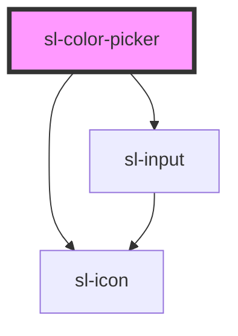

# Color Picker

```html preview
<sl-color-picker opacity format="hsl"></sl-color-picker>
```


<!-- Auto Generated Below -->


## Properties

| Property    | Attribute   | Description                                                                                                                                                                                                                                                              | Type                      | Default                                                                                                                                                                                                                                 |
| ----------- | ----------- | ------------------------------------------------------------------------------------------------------------------------------------------------------------------------------------------------------------------------------------------------------------------------ | ------------------------- | --------------------------------------------------------------------------------------------------------------------------------------------------------------------------------------------------------------------------------------- |
| `format`    | `format`    | The format to use for the generated color `value`. If opacity is enabled, these will translate to HEXA, RGBA, and HSLA respectively. Note that browser support for HEXA doesn't include pre-Chromium Edge, so it's usually safer to use RGBA or HSLA when using opacity. | `"hex" \| "hsl" \| "rgb"` | `'hex'`                                                                                                                                                                                                                                 |
| `opacity`   | `opacity`   | Whether to show the opacity slider.                                                                                                                                                                                                                                      | `boolean`                 | `false`                                                                                                                                                                                                                                 |
| `swatches`  | --          | An array of predefined color swatches to display.                                                                                                                                                                                                                        | `string[]`                | `[     '#d0021b',     '#f5a623',     '#f8e71c',     '#8b572a',     '#7ed321',     '#417505',     '#bd10e0',     '#9013fe',     '#4a90e2',     '#50e3c2',     '#b8e986',     '#000',     '#444',     '#888',     '#ccc',     '#fff'   ]` |
| `uppercase` | `uppercase` | By default, the value will be set in lowercase. Set this to true to set it in uppercase instead.                                                                                                                                                                         | `boolean`                 | `false`                                                                                                                                                                                                                                 |
| `value`     | `value`     | The current color.                                                                                                                                                                                                                                                       | `string`                  | `'#00ff00'`                                                                                                                                                                                                                             |


## Dependencies

### Depends on

- [sl-icon](../icon)
- [sl-input](../input)

### Graph


----------------------------------------------


