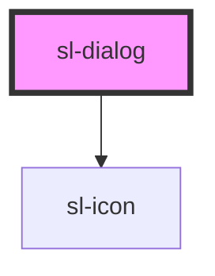

# Dialog

```html preview
<sl-dialog label="Dialog" id="dialog-1">
  Lorem ipsum dolor sit amet, consectetur adipiscing elit.
  <sl-button slot="footer" type="primary" data-dialog="close">Close</sl-button>
</sl-dialog>

<sl-button id="dialog-1-open">Open Dialog</sl-button>

<script>
  (() => {
    const dialog = document.querySelector('#dialog-1');
    const openButton = document.querySelector('#dialog-1-open');
    
    openButton.addEventListener('click', () => dialog.open = true);
  })();
</script>
```

<!-- Auto Generated Below -->


## Properties

| Property       | Attribute        | Description                                                                                                                                                                     | Type      | Default |
| -------------- | ---------------- | ------------------------------------------------------------------------------------------------------------------------------------------------------------------------------- | --------- | ------- |
| `closeOnClick` | `close-on-click` | When true, clicking on the overlay will close the dialog.                                                                                                                       | `boolean` | `false` |
| `label`        | `label`          | The dialog's label as displayed in the header. You should still include a relevant label when using `no-header`, as it is still used under the hood for accessibility purposes. | `string`  | `''`    |
| `noFooter`     | `no-footer`      | Set to true to disable the footer.                                                                                                                                              | `boolean` | `false` |
| `noHeader`     | `no-header`      | Set to true to disable the header. This will also remove the default close button, so please ensure you provide an easy, accessible way for users to dismiss the dialog.        | `boolean` | `false` |
| `open`         | `open`           | Set to true to show the modal.                                                                                                                                                  | `boolean` | `false` |


## Events

| Event          | Description                                                       | Type               |
| -------------- | ----------------------------------------------------------------- | ------------------ |
| `slAfterClose` | Emitted after the dialog closes and all transitions are complete. | `CustomEvent<any>` |
| `slAfterOpen`  | Emitted after the dialog opens and all transitions are complete.  | `CustomEvent<any>` |
| `slClose`      | Emitted when the dialog closes.                                   | `CustomEvent<any>` |
| `slOpen`       | Emitted when the dialog opens.                                    | `CustomEvent<any>` |


## Slots

| Slot       | Description                                                                                                                                                                           |
| ---------- | ------------------------------------------------------------------------------------------------------------------------------------------------------------------------------------- |
|            | The dialog's content.                                                                                                                                                                 |
| `"footer"` | The dialog's footer, usually one or more buttons representing various actions. For convenience, any element with `data-dialog="close"` will trigger the dialog to close when clicked. |


## Dependencies

### Depends on

- [sl-icon](../icon)

### Graph


----------------------------------------------


