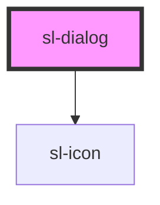

# sl-dialog

<!-- Auto Generated Below -->

## Properties

| Property              | Attribute               | Description                                                                                                                                                              | Type      | Default |
| --------------------- | ----------------------- | ------------------------------------------------------------------------------------------------------------------------------------------------------------------------ | --------- | ------- |
| `ignoreOverlayClicks` | `ignore-overlay-clicks` | When true, the dialog will not be dismissed when the user clicks on the overlay.                                                                                         | `boolean` | `false` |
| `label`               | `label`                 | The dialog's label as displayed in the header. You should always include a relevant label even when using `no-header`, as it is required for proper accessibility.       | `string`  | `''`    |
| `noFooter`            | `no-footer`             | Set to true to disable the footer.                                                                                                                                       | `boolean` | `false` |
| `noHeader`            | `no-header`             | Set to true to disable the header. This will also remove the default close button, so please ensure you provide an easy, accessible way for users to dismiss the dialog. | `boolean` | `false` |
| `open`                | `open`                  | Indicates whether or not the dialog is open.                                                                                                                             | `boolean` | `false` |

## Events

| Event         | Description                                                                                         | Type               |
| ------------- | --------------------------------------------------------------------------------------------------- | ------------------ |
| `slAfterHide` | Emitted after the dialog closes and all transitions are complete.                                   | `CustomEvent<any>` |
| `slAfterShow` | Emitted after the dialog opens and all transitions are complete.                                    | `CustomEvent<any>` |
| `slHide`      | Emitted when the dialog closes. Calling `event.preventDefault()` will prevent it from being closed. | `CustomEvent<any>` |
| `slShow`      | Emitted when the dialog opens. Calling `event.preventDefault()` will prevent it from being opened.  | `CustomEvent<any>` |

## Methods

### `hide() => Promise<boolean>`

Hides the dialog

#### Returns

Type: `Promise<boolean>`

### `show() => Promise<boolean>`

Shows the dialog

#### Returns

Type: `Promise<boolean>`

## Slots

| Slot       | Description                                                                    |
| ---------- | ------------------------------------------------------------------------------ |
|            | The dialog's content.                                                          |
| `"footer"` | The dialog's footer, usually one or more buttons representing various options. |

## CSS Custom Properties

| Name      | Description                                                                                         |
| --------- | --------------------------------------------------------------------------------------------------- |
| `--width` | The preferred width of the dialog. Note that the dialog will shrink to accommodate smaller screens. |

## Dependencies

### Depends on

- [sl-icon](../icon)

### Graph

----------------------------------------------

*Built with [StencilJS](https://stenciljs.com/)*
