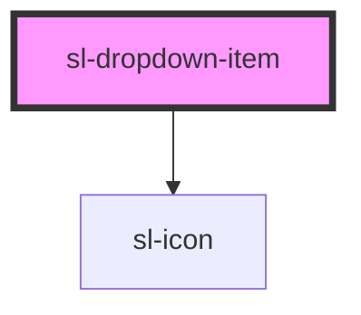

# Dropdown Item

TODO

<!-- Auto Generated Below -->

## Properties

| Property   | Attribute  | Description                                                | Type      | Default |
| ---------- | ---------- | ---------------------------------------------------------- | --------- | ------- |
| `active`   | `active`   | Set to true to draw the dropdown item in an active state.  | `boolean` | `false` |
| `checked`  | `checked`  | Set to true to draw the item in a checked state.           | `boolean` | `false` |
| `disabled` | `disabled` | Set to true to draw the dropdown item in a disabled state. | `boolean` | `false` |

## Events

| Event      | Description | Type               |
| ---------- | ----------- | ------------------ |
| `slSelect` |             | `CustomEvent<any>` |

## Slots

| Slot           | Description                                                      |
| -------------- | ---------------------------------------------------------------- |
|                | The dropdown item's label.                                       |
| `"check-icon"` | An icon to use in lieu of the default check icon.                |
| `"prefix"`     | Used to prepend an icon or similar element to the dropdown item. |
| `"suffix"`     | Used to append an icon or similar element to the dropdown item.  |

## Dependencies

### Depends on

- [sl-icon](../icon)

### Graph

----------------------------------------------

