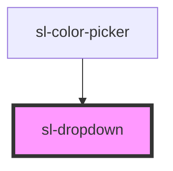

# sl-dropdown

<!-- Auto Generated Below -->

## Properties

| Property            | Attribute   | Description                                                                                                                              | Type                                                                                                                                                                 | Default          |
| ------------------- | ----------- | ---------------------------------------------------------------------------------------------------------------------------------------- | -------------------------------------------------------------------------------------------------------------------------------------------------------------------- | ---------------- |
| `containingElement` | --          | The dropdown will close when the user interacts outside of this element (e.g. clicking).                                                 | `HTMLElement`                                                                                                                                                        | `this.host`      |
| `open`              | `open`      | Indicates whether or not the dropdown is open.                                                                                           | `boolean`                                                                                                                                                            | `false`          |
| `placement`         | `placement` | The preferred placement of the dropdown menu. Note that the actual placement may vary as needed to keep the menu inside of the viewport. | `"bottom" \| "bottom-end" \| "bottom-start" \| "left" \| "left-end" \| "left-start" \| "right" \| "right-end" \| "right-start" \| "top" \| "top-end" \| "top-start"` | `'bottom-start'` |

## Events

| Event         | Description                                                                                           | Type               |
| ------------- | ----------------------------------------------------------------------------------------------------- | ------------------ |
| `slAfterHide` | Emitted after the dropdown closes and all transitions are complete.                                   | `CustomEvent<any>` |
| `slAfterShow` | Emitted after the dropdown opens and all transitions are complete.                                    | `CustomEvent<any>` |
| `slHide`      | Emitted when the dropdown closes. Calling `event.preventDefault()` will prevent it from being closed. | `CustomEvent<any>` |
| `slShow`      | Emitted when the dropdown opens. Calling `event.preventDefault()` will prevent it from being opened.  | `CustomEvent<any>` |

## Methods

### `hide() => Promise<void>`

Hides the dropdown menu

#### Returns

Type: `Promise<void>`

### `show() => Promise<void>`

Shows the dropdown menu

#### Returns

Type: `Promise<void>`

## Slots

| Slot        | Description                                              |
| ----------- | -------------------------------------------------------- |
|             | The dropdown's menu items.                               |
| `"trigger"` | The dropdown's trigger, usually a `<sl-button>` element. |

## Dependencies

### Used by

 - [sl-color-picker](../color-picker)

### Graph

----------------------------------------------

*Built with [StencilJS](https://stenciljs.com/)*
