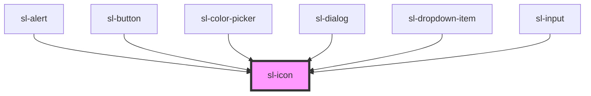

# sl-icon

<!-- Auto Generated Below -->

## Properties

| Property      | Attribute      | Description                                                                                                   | Type     | Default     |
| ------------- | -------------- | ------------------------------------------------------------------------------------------------------------- | -------- | ----------- |
| `label`       | `label`        | An alternative description to use for accessibility. If omitted, the name or src will be used to generate it. | `string` | `undefined` |
| `name`        | `name`         | The name of the icon to draw.                                                                                 | `string` | `undefined` |
| `src`         | `src`          | An external URL of an SVG file.                                                                               | `string` | `undefined` |
| `strokeWidth` | `stroke-width` | Sets the stroke width in supported icons.                                                                     | `string` | `'1.5'`     |

## Dependencies

### Used by

 - [sl-alert](../alert)
 - [sl-button](../button)
 - [sl-color-picker](../color-picker)
 - [sl-dialog](../dialog)
 - [sl-dropdown-item](../dropdown-item)
 - [sl-input](../input)

### Graph

----------------------------------------------

*Built with [StencilJS](https://stenciljs.com/)*
