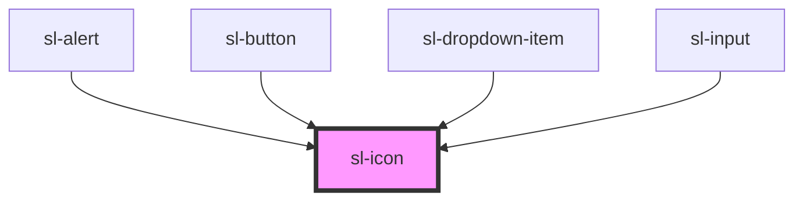

# Icon

<sl-icon name="alarm"></sl-icon>
<sl-icon name="archive"></sl-icon>
<sl-icon name="battery"></sl-icon>
<sl-icon name="bell"></sl-icon>
<sl-icon name="clock"></sl-icon>
<sl-icon name="chevron-down"></sl-icon>
<sl-icon name="download"></sl-icon>
<sl-icon name="exclamation-triangle"></sl-icon>
<sl-icon name="file-earmark"></sl-icon>
<sl-icon name="flag"></sl-icon>
<sl-icon name="image"></sl-icon>
<sl-icon name="mic"></sl-icon>
<sl-icon name="search"></sl-icon>
<sl-icon name="trash"></sl-icon>
<sl-icon name="x-circle"></sl-icon>

<sl-icon src="https://s3-us-west-2.amazonaws.com/s.cdpn.io/106114/tiger.svg" style="width: 100px; height: 100px;"></sl-icon>

<!-- Auto Generated Below -->

## Properties

| Property | Attribute | Description                                                                                                   | Type     | Default     |
| -------- | --------- | ------------------------------------------------------------------------------------------------------------- | -------- | ----------- |
| `label`  | `label`   | An alternative description to use for accessibility. If omitted, the name or src will be used to generate it. | `string` | `undefined` |
| `name`   | `name`    | The name of the icon to draw.                                                                                 | `string` | `undefined` |
| `src`    | `src`     | An external URL of the SVG file to fetch.                                                                     | `string` | `undefined` |

## Dependencies

### Used by

 - [sl-alert](../alert)
 - [sl-button](../button)
 - [sl-dropdown-item](../dropdown-item)
 - [sl-input](../input)

### Graph

----------------------------------------------

