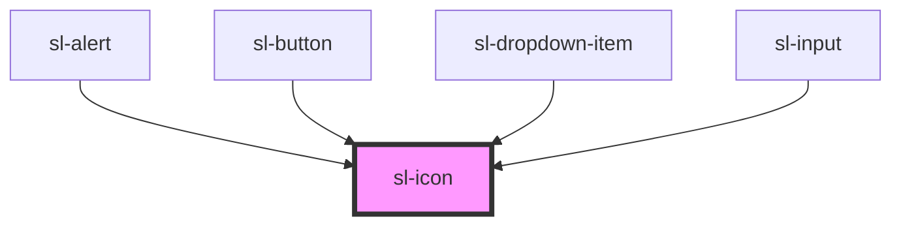

# Icon

```html preview
<div style="font-size: 1rem; margin-bottom: 2rem;">
  <sl-icon name="alert-triangle"></sl-icon>
  <sl-icon name="archive"></sl-icon>
  <sl-icon name="battery"></sl-icon>
  <sl-icon name="bell"></sl-icon>
  <sl-icon name="clock"></sl-icon>
  <sl-icon name="chevron-down"></sl-icon>
  <sl-icon name="download"></sl-icon>
  <sl-icon name="file"></sl-icon>
  <sl-icon name="flag"></sl-icon>
  <sl-icon name="image"></sl-icon>
  <sl-icon name="mic"></sl-icon>
  <sl-icon name="search"></sl-icon>
  <sl-icon name="trash"></sl-icon>
  <sl-icon name="x-circle"></sl-icon>
</div>

<div style="font-size: 2rem; margin-bottom: 2rem;">
  <sl-icon name="alert-triangle"></sl-icon>
  <sl-icon name="archive"></sl-icon>
  <sl-icon name="battery"></sl-icon>
  <sl-icon name="bell"></sl-icon>
  <sl-icon name="clock"></sl-icon>
  <sl-icon name="chevron-down"></sl-icon>
  <sl-icon name="download"></sl-icon>
  <sl-icon name="file"></sl-icon>
  <sl-icon name="flag"></sl-icon>
  <sl-icon name="image"></sl-icon>
  <sl-icon name="mic"></sl-icon>
  <sl-icon name="search"></sl-icon>
  <sl-icon name="trash"></sl-icon>
  <sl-icon name="x-circle"></sl-icon>
</div>
```

Icons are courtesy of [Bootstrap Icons](https://icons.getbootstrap.com/).

<!-- Auto Generated Below -->


## Properties

| Property      | Attribute      | Description                                                                                                   | Type     | Default     |
| ------------- | -------------- | ------------------------------------------------------------------------------------------------------------- | -------- | ----------- |
| `label`       | `label`        | An alternative description to use for accessibility. If omitted, the name or src will be used to generate it. | `string` | `undefined` |
| `name`        | `name`         | The name of the icon to draw.                                                                                 | `string` | `undefined` |
| `src`         | `src`          | An external URL of an SVG file.                                                                               | `string` | `undefined` |
| `strokeWidth` | `stroke-width` | Sets the stroke width in supported icons.                                                                     | `string` | `'1.5'`     |


## Dependencies

### Used by

 - [sl-alert](../alert)
 - [sl-button](../button)
 - [sl-dropdown-item](../dropdown-item)
 - [sl-input](../input)

### Graph


----------------------------------------------


