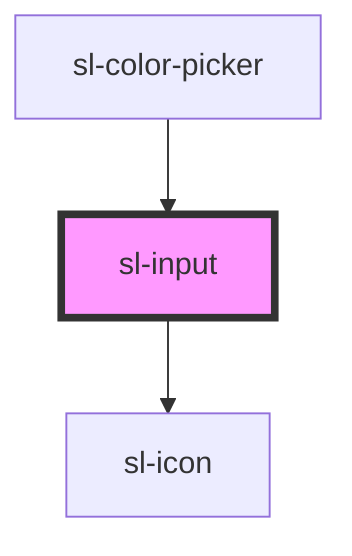

# Input

```html preview
<sl-input type="text" placeholder="Small" size="small"></sl-input>

<br><br>

<sl-input type="text" placeholder="Medium" size="medium"></sl-input>

<br><br>

<sl-input type="text" placeholder="Large" size="large"></sl-input>

<br><br>

<sl-input type="text" placeholder="Small" size="small">
  <sl-icon name="tag" slot="prefix"></sl-icon>
  <sl-icon name="settings" slot="suffix"></sl-icon>
</sl-input>

<br><br>

<sl-input type="text" placeholder="Medium" size="medium">
  <sl-icon name="tag" slot="prefix"></sl-icon>
  <sl-icon name="settings" slot="suffix"></sl-icon>
</sl-input>

<br><br>

<sl-input type="text" placeholder="Large" size="large">
  <sl-icon name="tag" slot="prefix"></sl-icon>
  <sl-icon name="settings" slot="suffix"></sl-icon>
</sl-input>

<br><br>

<sl-input type="text" placeholder="Clearable" size="small" clearable></sl-input>

<br><br>

<sl-input type="text" placeholder="Clearable" size="medium" clearable></sl-input>

<br><br>

<sl-input type="text" placeholder="Clearable" size="large" clearable></sl-input>

<br><br>

<sl-input type="password" placeholder="Password Toggle" size="small" toggle-password></sl-input>

<br><br>

<sl-input type="password" placeholder="Password Toggle" size="medium" toggle-password></sl-input>

<br><br>

<sl-input type="password" placeholder="Password Toggle" size="large" toggle-password></sl-input>

<br><br>

<sl-input type="text" placeholder="Disabled" size="small" disabled></sl-input>

<br><br>

<sl-input type="text" placeholder="Disabled" size="medium" disabled></sl-input>

<br><br>

<sl-input type="text" placeholder="Disabled" size="large" disabled></sl-input>

<br><br>

<sl-input type="number" placeholder="Number"></sl-input>
```


<!-- Auto Generated Below -->


## Properties

| Property         | Attribute         | Description                                                      | Type                                                                                  | Default     |
| ---------------- | ----------------- | ---------------------------------------------------------------- | ------------------------------------------------------------------------------------- | ----------- |
| `autocapitalize` | `autocapitalize`  | The input's autocaptialize attribute.                            | `string`                                                                              | `undefined` |
| `autocomplete`   | `autocomplete`    | The input's autocomplete attribute.                              | `string`                                                                              | `undefined` |
| `autocorrect`    | `autocorrect`     | The input's autocorrect attribute.                               | `string`                                                                              | `undefined` |
| `autofocus`      | `autofocus`       | The input's autofocus attribute.                                 | `boolean`                                                                             | `undefined` |
| `clearable`      | `clearable`       | Set to true to add a clear button when the input is populated.   | `boolean`                                                                             | `false`     |
| `disabled`       | `disabled`        | Set to true to disable the input.                                | `boolean`                                                                             | `false`     |
| `inputmode`      | `inputmode`       | The input's inputmode attribute.                                 | `"decimal" \| "email" \| "none" \| "numeric" \| "search" \| "tel" \| "text" \| "url"` | `undefined` |
| `max`            | `max`             | The input's max attribute.                                       | `number`                                                                              | `undefined` |
| `maxlength`      | `maxlength`       | The input's maxlength attribute.                                 | `number`                                                                              | `undefined` |
| `min`            | `min`             | The input's min attribute.                                       | `number`                                                                              | `undefined` |
| `minlength`      | `minlength`       | The input's minlength attribute.                                 | `number`                                                                              | `undefined` |
| `name`           | `name`            | The input's name attribute.                                      | `string`                                                                              | `''`        |
| `pattern`        | `pattern`         | The input's pattern attribute.                                   | `string`                                                                              | `undefined` |
| `placeholder`    | `placeholder`     | The input's placeholder text.                                    | `string`                                                                              | `undefined` |
| `readonly`       | `readonly`        | Set to true for a readonly input.                                | `boolean`                                                                             | `false`     |
| `required`       | `required`        | The input's required attribute.                                  | `boolean`                                                                             | `undefined` |
| `size`           | `size`            | The input's size, one of `small`, `medium`, or `large`.          | `string`                                                                              | `'medium'`  |
| `step`           | `step`            | The input's step attribute.                                      | `number`                                                                              | `undefined` |
| `togglePassword` | `toggle-password` | Set to true to add a password toggle button for password inputs. | `boolean`                                                                             | `false`     |
| `type`           | `type`            | The input's type, one of `text`, `number`, `email`, etc.         | `"email" \| "number" \| "password" \| "search" \| "tel" \| "text" \| "url"`           | `'text'`    |
| `value`          | `value`           | The input's value attribute.                                     | `string`                                                                              | `''`        |


## Events

| Event      | Description                               | Type               |
| ---------- | ----------------------------------------- | ------------------ |
| `slBlur`   | Emitted when the control loses focus.     | `CustomEvent<any>` |
| `slChange` | Emitted when the control's value changes. | `CustomEvent<any>` |
| `slFocus`  | Emitted when the control gains focus.     | `CustomEvent<any>` |
| `slInput`  | Emitted when the control receives input.  | `CustomEvent<any>` |


## Methods

### `removeFocus() => Promise<void>`

Removes focus from the input.

#### Returns

Type: `Promise<void>`


### `select() => Promise<void>`

Selects all the text in the input.

#### Returns

Type: `Promise<void>`


### `setFocus() => Promise<void>`

Sets focus on the input.

#### Returns

Type: `Promise<void>`


### `setRangeText(replacement: string, start: number, end: number, selectMode?: SelectionMode) => Promise<void>`

Replaces a range of text with a new string.

#### Returns

Type: `Promise<void>`


### `setSelectionRange(selectionStart: number, selectionEnd: number, selectionDirection?: "none" | "forward" | "backward") => Promise<void>`

Sets the start and end positions of the text selection (0-based).

#### Returns

Type: `Promise<void>`


## Slots

| Slot                   | Description                                               |
| ---------------------- | --------------------------------------------------------- |
| `"clear-icon"`         | An icon to use in lieu of the default clear icon.         |
| `"hide-password-icon"` | An icon to use in lieu of the default hide password icon. |
| `"prefix"`             | Used to prepend an icon or similar element to the input.  |
| `"show-password-icon"` | An icon to use in lieu of the default show password icon. |
| `"suffix"`             | Used to append an icon or similar element to the input.   |


## Dependencies

### Used by

 - [sl-color-picker](../color-picker)

### Depends on

- [sl-icon](../icon)

### Graph


----------------------------------------------


